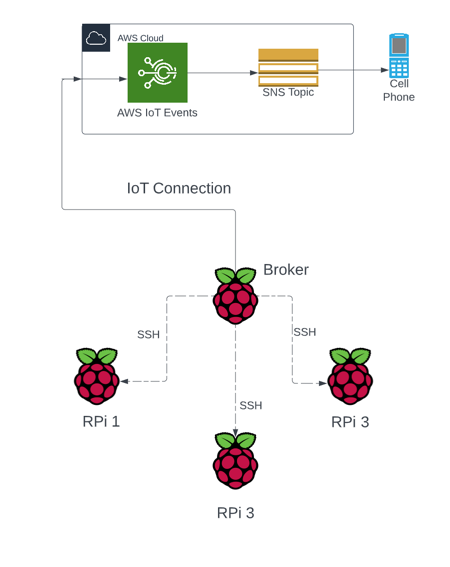
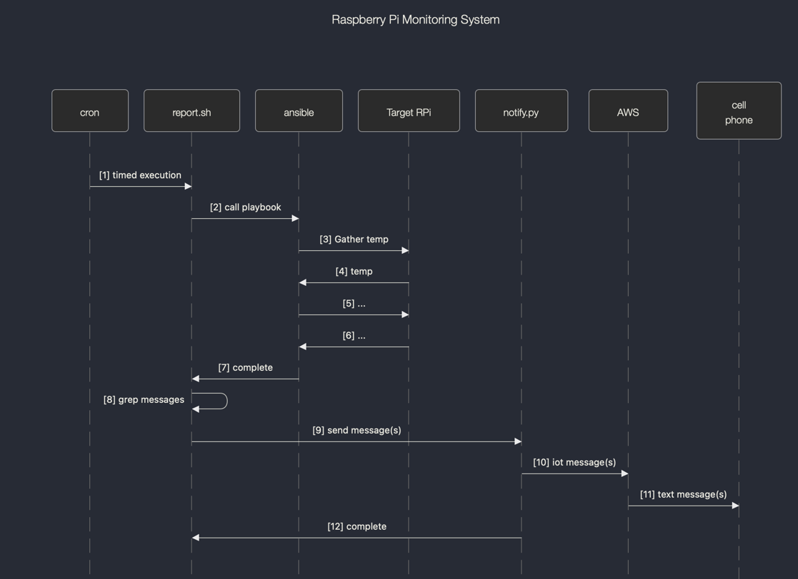

# Table of Contents
  - [Overview](#overview)
  - [Technical Description](#technical-description)
  - [Design Diagram](#design-diagram)
  - [Sequence of Events](#sequence-of-events)
  - [Installation](#installation)
    - [Ansible Prep](#ansible-prep)
  - [FAQ](#faq)
<br><br>
# Overview
I've accumulated quite a farm of Raspberry Pis over the years.  One problem is making sure 
they are operating properly.  This project is meant to verify that.
<br><br>

# Technical Description
There are two primary technologies in use here.  One is Amazon Web Services (AWS) Internet of Things 
(IoT) core services. The other is Ansible. AWS IoT Core provides the infrastructure needed to 
interact with the RPis and send SMS text messages to my cell phone when anomalies are detected. 
Ansible is an enterprise-grade tool to ssh into endpoints and gather relevant information.

The IoT device, which I'll call the "broker", is connected to AWS.  It periodically runs an Ansible 
script to connect to each RPi and gather telemetry information. As the ansible playbook runs, any anomalies are
flagged using a special message string.  The message sting is given to a python utility which then forwards it 
to AWS. AWS IoT Core causes it to be sent as a text message on my cell phone.
<br><br>

# Design Diagram


# Sequence of Events

1. A cron job is scheduled on the broker
2. The bash script `report.sh` is executed, which calls `ansible-playbook`
3. The ansible playbook `gather-telemetry.yaml` queries the target RPi for the first piece of telemetry data, the RPi's core temperature.
4. The RPi responds with the temperature data.
5. Subsequent queries are sent
6. Each query gets an answer
7. The ansible playbook completes
8. We grep the output to find any error conditions
9. IF errors are found, we invoke the `notify.py` script with the offending information
10. We forward that information to AWS
11. AWS creates SMS message(s) which is sent to my cell phone
12. The `notify.py` script exits
# Installation
## Ansible Prep
Using Ansible requires very little configuration on the endpoint Raspberry Pi hosts, but it does need quite a bit of configuration on the broker host.
1. First we need to create a key for connecting to each RPi. Do this on the broker only. Run the `ssh-keygen` command and make sure you specify a passphrase. There are more details [here](https://www.ssh.com/academy/ssh/keygen). 
2. Now we need create the ssh agent so we don't have to keep typing in our passphrase each time we use Ansible. 
3. To make sure we keep the agent running forever on your broker, add this to your bash startup script and reboot:
```bash
  SSH_ENV="$HOME/.ssh/agent-environment"

  function start_agent {
    echo "Initialising new SSH agent..."
    /usr/bin/ssh-agent | sed 's/^echo/#echo/' >"${SSH_ENV}"
    echo succeeded
    chmod 600 "${SSH_ENV}"
    . "${SSH_ENV}" >/dev/null
    /usr/bin/ssh-add
  }

  # Source SSH settings, if applicable

  if [ -f "${SSH_ENV}" ]; then
    . "${SSH_ENV}" >/dev/null
    #ps ${SSH_AGENT_PID} doesn't work under cywgin
    ps -ef | grep ${SSH_AGENT_PID} | grep ssh-agent$ >/dev/null || {
      start_agent
    }
  else
    start_agent
  fi
```
4. You will be asked _once_ for the passphrase after your broker system reboots. After that, you won't have to worry about it.
5. Now we need to configure the connections to each RPi endpoint.
6. Next, we configure the endpoints to be reached without using using IDs and passwords. On your broker, on its command line, type the `ssh-copy-id` command. Do this for each RPi endpoint. 
```bash
╰─➤  ssh-copy-id hall.local
/usr/bin/ssh-copy-id: INFO: attempting to log in with the new key(s), to filter out any that are already installed
/usr/bin/ssh-copy-id: INFO: 1 key(s) remain to be installed -- if you are prompted now it is to install the new keys
Warning: Permanently added 'hall.local' (ED25519) to the list of known hosts.
tennis@hall.local's password:

Number of key(s) added: 1

Now try logging into the machine, with:   "ssh 'hall.local'"
and check to make sure that only the key(s) you wanted were added.
```
7. Make a copy of the `sample_hosts` file and call it `hosts`.  Substitute the the RPi names with your own Raspberry Pi names.
8. Install ansible using your package manager.  Since I'm using Ubuntu, here is that command
```bash
sudo apt-get install ansible -y
```
9. Now you're ready to try ansible.  In the ansible directory, try this ansible ping command: `ansible all -m ping`
```bash
╰─➤  ansible all -m ping
cat-doorbell.local | SUCCESS => {
    "changed": false,
    "ping": "pong"
}
garage-bot.local | SUCCESS => {
    "changed": false,
    "ping": "pong"
}
stair-lights.local | SUCCESS => {
    "changed": false,
    "ping": "pong"
}
front-porch-lights.local | SUCCESS => {
    "changed": false,
    "ping": "pong"
}
livingroom-clock.local | SUCCESS => {
    "changed": false,
    "ping": "pong"
}
office-clock.local | SUCCESS => {
    "changed": false,
    "ping": "pong"
}
```
### Amazon IoT Setup
1. Look at the writeup [here](https://github.com/gamename/raspberry-pi-iot-cat-doorbell) to configure the Amazon IoT setup.

### Cron Job Setup
1. Run this command on the broker command line *after* you read the README.md file in the same `cron` directory.
```bash
crontab report_cron_job
```
# FAQ
Q. Why not use MQTT to connect to the different Raspberry Pis?<br>
A. That is one possible solution.  But it requires a continuously running script in each RPi. So you have to configure
each RPi individually.  My solution relies on configuring only the broker system and leaves the others untouched.
<br><br>
Q. Why not use IFTTT to send an SMS message? <br>
A. That is also a possible solution. But I am familiar with AWS and I like the robust services it offers. 
<br><br>
Q. What telemetry do you gather?<br>
A. Uptime, CPU utilization, internal temperature, disk utilization, and of course, accessibility.
<br><br>
Q. What happens if one of the telemetry values indicates a problem?<br>
A. A message is sent via AWS IoT which triggers an SMS message.